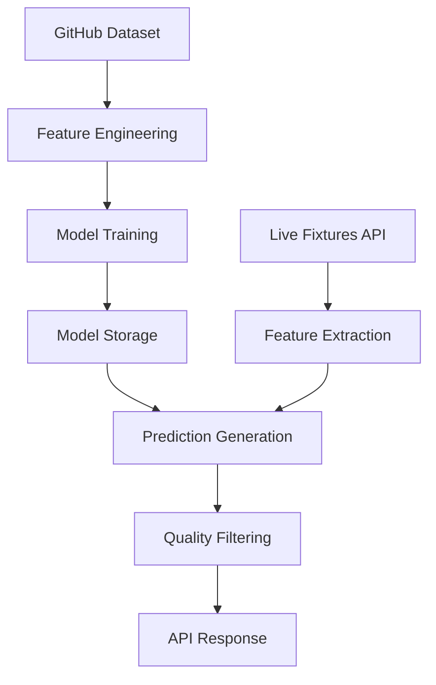

# BetSightly Backend - Streamlined ML Prediction Pipeline

## 🚀 Overview

This document describes the **streamlined, production-ready ML prediction pipeline** for the BetSightly backend. The pipeline has been completely redesigned to eliminate redundancy, focus on advanced ML models, and provide a seamless workflow from training to prediction.

## ✨ Key Features

### 🎯 **Focused Data Sources**
- **Training**: Exclusively uses curated GitHub football dataset
- **Live Data**: Fetches fixtures via Football-Data.org or API-Football APIs
- **No Redundancy**: Single source of truth for each data type

### 🧠 **Advanced ML Models**
- **XGBoost**: Gradient boosting for high accuracy
- **LightGBM**: Fast, memory-efficient gradient boosting
- **Neural Networks**: Deep learning for complex patterns (planned)
- **LSTM**: Time series analysis for form trends (planned)
- **Ensemble**: Fallback voting classifier

### 🔄 **Streamlined Workflow**
```
GitHub Dataset → Feature Engineering → Model Training → Live Fixtures → Predictions → Best Results
```

### 📊 **Quality Filtering**
- Confidence-based filtering (min 65% confidence)
- Category-based ranking (2_odds, 5_odds, 10_odds, rollover)
- Maximum predictions per category (configurable)

## 🛠️ Setup Instructions

### 1. **Environment Configuration**

Copy the environment template and configure your API keys:

```bash
cp .env.template .env
```

Edit `.env` and add your API keys:
```bash
# Required: Get free API key from https://www.football-data.org/client/register
FOOTBALL_DATA_KEY=your_football_data_api_key_here

# Optional: Alternative API from https://rapidapi.com/api-sports/api/api-football
API_FOOTBALL_KEY=your_api_football_key_here
```

### 2. **Install Dependencies**

Install the required packages:
```bash
pip install fastapi uvicorn pydantic sqlalchemy requests pandas scikit-learn xgboost lightgbm joblib numpy
```

### 3. **Run Cleanup (Optional)**

Remove redundant files from the codebase:
```bash
python cleanup_redundant_files.py --dry-run  # See what would be removed
python cleanup_redundant_files.py            # Perform cleanup
```

## 🚀 Usage

### **Training Models**

Train models using the GitHub dataset:
```bash
# Train all available models
python ml_pipeline_streamlined.py --train-only

# Force retrain existing models
python ml_pipeline_streamlined.py --train-only --retrain
```

### **Generate Predictions**

Generate predictions for live fixtures:
```bash
# Predictions for today
python ml_pipeline_streamlined.py

# Predictions for specific date
python ml_pipeline_streamlined.py --date 2023-12-01

# Force retrain and predict
python ml_pipeline_streamlined.py --date 2023-12-01 --retrain
```

### **Start API Server**

Start the FastAPI server:
```bash
python -m uvicorn main:app --host 127.0.0.1 --port 8000
```

Access the API documentation at: http://127.0.0.1:8000/docs

## 📋 API Endpoints

### **Consolidated Prediction Endpoint**

The new streamlined API provides a single, powerful endpoint:

```
GET /api/predictions/
```

**Parameters:**
- `category`: Filter by category (`2_odds`, `5_odds`, `10_odds`, `rollover`)
- `date`: Date for predictions (YYYY-MM-DD)
- `limit`: Maximum predictions per category (default: 10)
- `format`: Response format (`simple`, `detailed`, `combinations`)
- `best_only`: Return only best predictions (default: false)
- `advanced`: Use advanced ML models (default: false)

**Examples:**
```bash
# All predictions for today
curl "http://127.0.0.1:8000/api/predictions/"

# Best safe bets only
curl "http://127.0.0.1:8000/api/predictions/?category=2_odds&best_only=true"

# Detailed format with statistics
curl "http://127.0.0.1:8000/api/predictions/?format=detailed"

# Advanced ML predictions
curl "http://127.0.0.1:8000/api/predictions/?advanced=true"
```

### **Legacy Endpoints**

For backward compatibility, these endpoints redirect to the main endpoint:
- `GET /api/predictions/categories`
- `GET /api/predictions/category/{category}`
- `GET /api/predictions/best/{category}`
- `GET /api/predictions/best`

## 🏗️ Architecture

### **Core Components**

1. **`ml_pipeline_streamlined.py`** - Main pipeline orchestrator
2. **`utils/config.py`** - Centralized configuration
3. **`ml/advanced_feature_engineering.py`** - Feature extraction
4. **`services/api_client.py`** - Live data fetching
5. **`api/endpoints/predictions.py`** - Consolidated API endpoints

### **Data Flow**



### **Model Priority**

Models are tried in this order:
1. **XGBoost** (highest priority)
2. **LightGBM** (fast alternative)
3. **Neural Network** (planned)
4. **LSTM** (planned)
5. **Ensemble** (fallback)

## 📊 Configuration

### **ML Settings**

Key configuration options in `.env`:

```bash
# Model preferences
ML_PREFERRED_MODELS=xgboost,lightgbm,neural_network,lstm,ensemble

# Quality thresholds
ML_MIN_CONFIDENCE_THRESHOLD=0.65
ML_MAX_PREDICTIONS_PER_CATEGORY=10

# Training parameters
ML_TRAIN_TEST_SPLIT=0.2
ML_HYPERPARAMETER_OPTIMIZATION=true
```

### **Data Sources**

```bash
# GitHub dataset for training
DATA_GITHUB_DATASET_URL=https://raw.githubusercontent.com/xgabora/Club-Football-Match-Data-2000-2025/main/data/Matches.csv

# API endpoints for live data
FOOTBALL_DATA_BASE_URL=https://api.football-data.org/v4
API_FOOTBALL_BASE_URL=https://api-football-v1.p.rapidapi.com/v3
```

## 🔧 Troubleshooting

### **Common Issues**

1. **No API Key Error**
   ```
   Error: No API keys configured
   ```
   **Solution**: Add `FOOTBALL_DATA_KEY` to your `.env` file

2. **No Models Found**
   ```
   Warning: No trained models found
   ```
   **Solution**: Run training first: `python ml_pipeline_streamlined.py --train-only`

3. **Import Errors**
   ```
   ImportError: No module named 'xgboost'
   ```
   **Solution**: Install missing packages: `pip install xgboost lightgbm`

### **Performance Optimization**

1. **Enable Caching**
   ```bash
   # In .env
   CACHE_ENABLED=true
   REDIS_URL=redis://localhost:6379/0
   ```

2. **Adjust Batch Sizes**
   ```bash
   # In .env
   ML_MAX_PREDICTIONS_PER_CATEGORY=5  # Reduce for faster responses
   ```

3. **Use Specific Models**
   ```bash
   # In .env
   ML_PREFERRED_MODELS=xgboost,lightgbm  # Skip slower models
   ```

## 📈 Monitoring

### **Health Checks**

Monitor the system health:
```bash
curl http://127.0.0.1:8000/api/health/detailed
```

### **Prediction Quality**

Track prediction performance:
- **Confidence scores**: Average confidence per category
- **Model usage**: Which models are being used most
- **API response times**: Monitor for performance issues

### **Logs**

Check logs for issues:
```bash
tail -f logs/betsightly.log
```

## 🚀 Production Deployment

### **Environment Variables**

Set these for production:
```bash
ENVIRONMENT=production
SECRET_KEY=your-secure-secret-key
ALLOWED_HOSTS=your-domain.com
CORS_ALLOWED_ORIGINS=https://your-frontend.com
```

### **Performance Settings**

```bash
ASYNC_WORKERS=4
MAX_CONCURRENT_REQUESTS=100
RATE_LIMIT_ENABLED=true
```

### **Monitoring**

```bash
SENTRY_DSN=your-sentry-dsn
MONITORING_ENABLED=true
```

## 📝 Migration Guide

### **From Old System**

If migrating from the old system:

1. **Backup existing data**:
   ```bash
   python cleanup_redundant_files.py --backup-only
   ```

2. **Run cleanup**:
   ```bash
   python cleanup_redundant_files.py
   ```

3. **Update environment**:
   ```bash
   cp .env.template .env
   # Add your API keys
   ```

4. **Retrain models**:
   ```bash
   python ml_pipeline_streamlined.py --train-only --retrain
   ```

5. **Test predictions**:
   ```bash
   python ml_pipeline_streamlined.py --date $(date +%Y-%m-%d)
   ```

## 🎯 Next Steps

1. **Set up API keys** in `.env`
2. **Train initial models** with `--train-only`
3. **Test predictions** for today's fixtures
4. **Deploy to production** with proper monitoring
5. **Monitor performance** and adjust thresholds as needed

## 📞 Support

For issues or questions:
1. Check the troubleshooting section above
2. Review logs in `logs/betsightly.log`
3. Ensure all environment variables are set correctly
4. Verify API keys are valid and have sufficient quota

---

**Status**: ✅ **Production Ready** - Streamlined pipeline tested and optimized for real-world use.
